# 【ゲーム追加フロー】
## 【準備物編】
- ROM(zip)
  - Releaseでビルドしたやつ
  - エラー落ちしないかどうか必ず確認
- ゲーム動画
  - PVが望ましい
  - 100MB以下の制限あり。60sくらいの動画だったら大丈夫なはず。
- Unityバージョン(6000.3.0f1を使用しています。下記リンクからDLしましょう。)
  - https://unity.com/releases/editor/whats-new/6000.3.0f1
- ゲームランチャーのリポジトリをクローン
  - やり方は下記に記載
 
## 【GitGUI編】
- 下記リンクからリポジトリを落としてくる。
  - https://github.com/Ukun115/GameLauncher
  - privateアクセスなので、伊関からコラボレーターとしてリポジトリに参加しないと「404 not found」が出てきます。
  - 【注意】zipをDLしてこないよう注意。リポジトリをクローンしてください。
- GitGUIはおそらく「Fork」を使用するはず
- 最新mainから作業ブランチ作成
  - ブランチ名は「苗字/作業内容」
  - ex) iseki/addGames

## 【Unity編】
- UnityHubからGameLauncher起動。
  - 起動出来たらAssets/Scenes/Launch.unityからシーンを開く。
  - 【注意】Unity6000.0.58f2を使用しています。下記リンクからDLしましょう。
  - https://unity.com/ja/releases/editor/whats-new/6000.0.58f2

- 下の画像のメニューからダイアログを表示し、学生作品の動画や情報を入力。全て入力し終わったら「実行」を押下。これで作品データ追加が完了です。

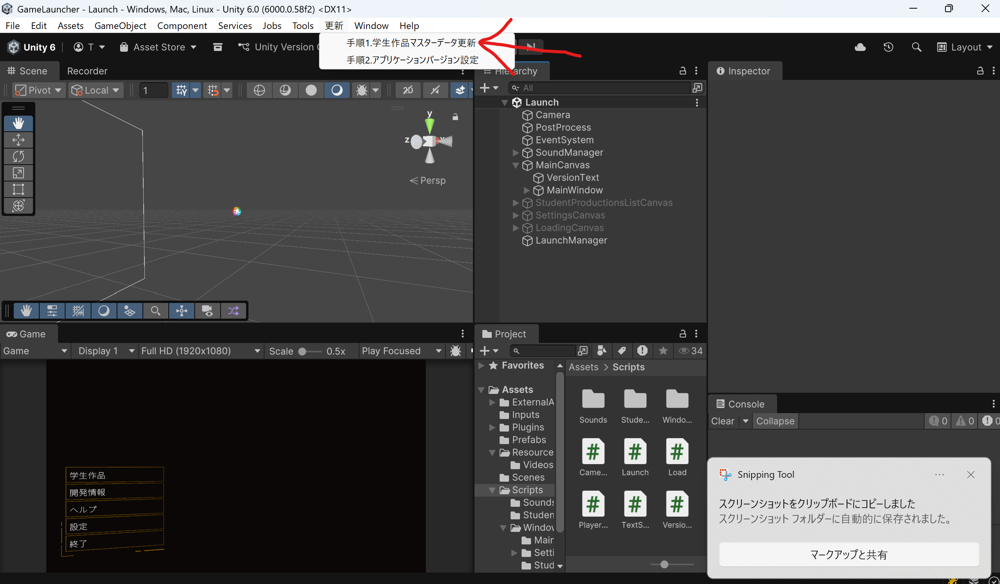

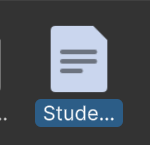

- 下の画像のメニューからダイアログを表示し、次のバージョンを入力。入力出来たら「適応」を押下。これでバージョン更新完了です。

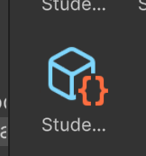

- 以上でUnity側の設定は終わり。

- 次にGitHub側の設定を行う。

## 【GitHub編】
- 下記リポジトリへアクセス
  - https://github.com/Ukun115/StudentProductions

- Releasesをクリック

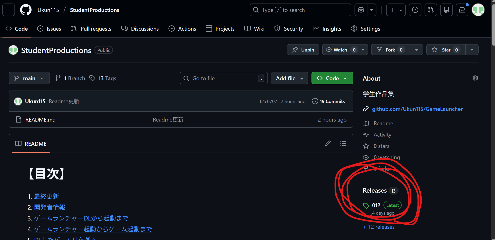

- 「Draft a new release」をクリック

- タグ作成。「Create new tag」から新しいタグを作成。
  - ゲームごとに3桁でナンバリングしています。最新のナンバリングに+1した半角の値にしてください。

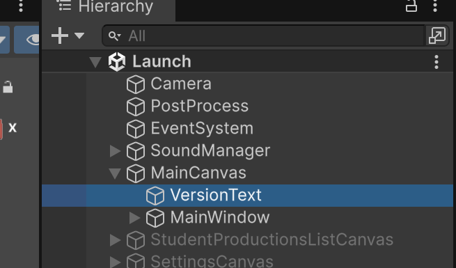

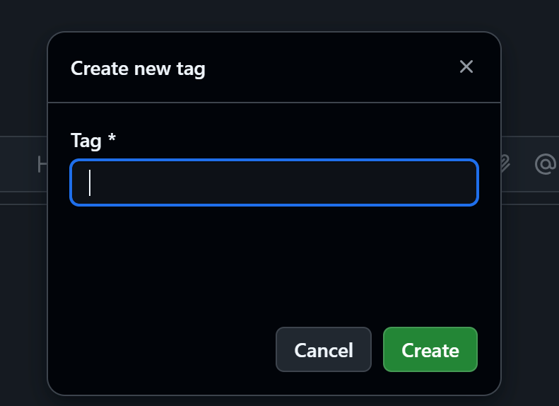

- タイトルはタグと同じく番号を半角入力。

- 概要記載
  - 卒年、作品名、制作者の3点を同じ形式で記入してください。
  
【サンプル】

卒年：27卒

作品名：KAWAHARA GAME

制作者：河原 太郎

- ROM(zip)を画像の箇所にD&D。
  - この時、ROM(zip)のフォルダ名はナンバリングと同じ名前にしておく。
  - ex) ナンバリングが013の場合、「013.zip」とする
  - アップロードには少々時間かかる

- アップロード完了したら、「Publish release」を押下

- 以上でゲームの格納は完了。

## 【動作チェック編】
- 次にUnityEditorでのゲーム起動確認を行う。
- 実行。追加したゲームのセルをクリックし待機。数分後にゲームが起動します。
  - DLされたゲームの格納場所は下記パスにあります。一度確認してみましょう。
  - C:\Users"ユーザー名"\AppData\LocalLow\DefaultCompany\GameLauncher\Games
  - 「temp」フォルダはDLしてきたzipが格納されるフォルダ。「Games」フォルダは解凍したROMが格納されるフォルダ。

## 【ゲームランチャービルド編】
- ビルド

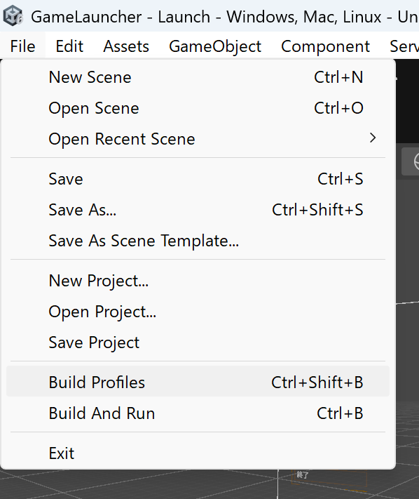
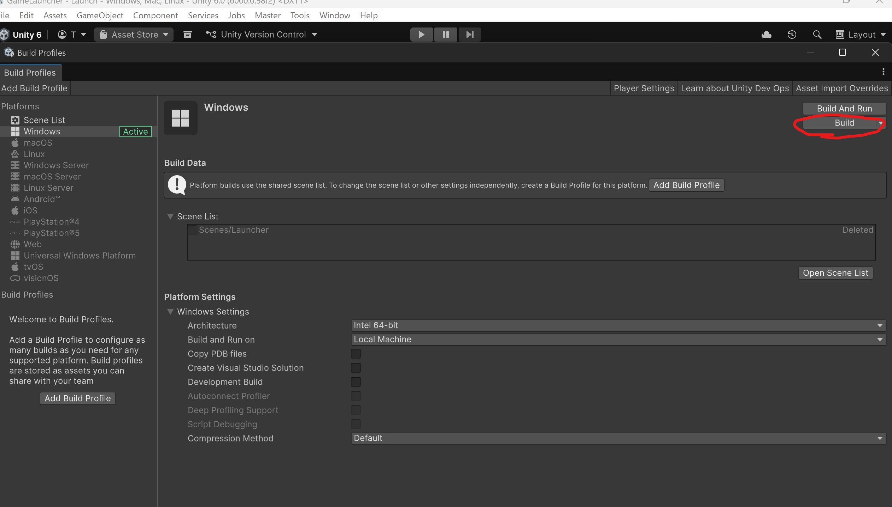

- ゲームランチャーのフォルダを作成し、作成したフォルダを選択
  - フォルダ名は「GameLauncher_vX.Y.Z」のようにする
  - 作ろうとしているバージョン名に合わせよう！自分のバージョンがどのバージョンになるかは下記リンクを参照。
  - https://github.com/Ukun115/StudentProductions?tab=readme-ov-file#%E3%82%B2%E3%83%BC%E3%83%A0%E3%83%A9%E3%83%B3%E3%83%81%E3%83%A3%E3%83%BC%E3%83%90%E3%83%BC%E3%82%B8%E3%83%A7%E3%83%B3%E8%A1%A8%E8%A8%98%E8%A6%8F%E5%89%87

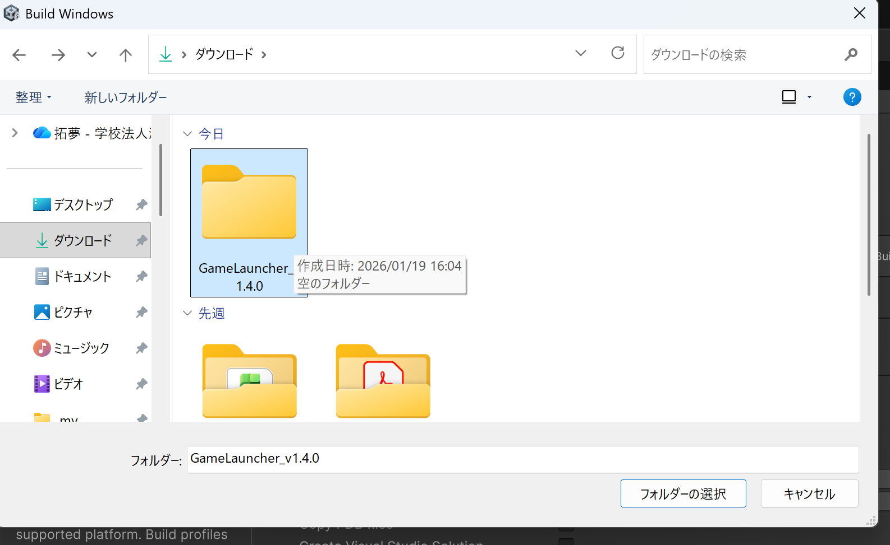

- 下記フォルダ名のフォルダは不要なので削除
  - GameLauncher_BurstDebugInformation_DoNotShip

- ビルドしたゲームランチャーのROMを起動し、動作チェック

- ゲームランチャーのROMをzip化
  - 【注意】下の画像のファイルたちを全選択し、ZIPファイルを選択

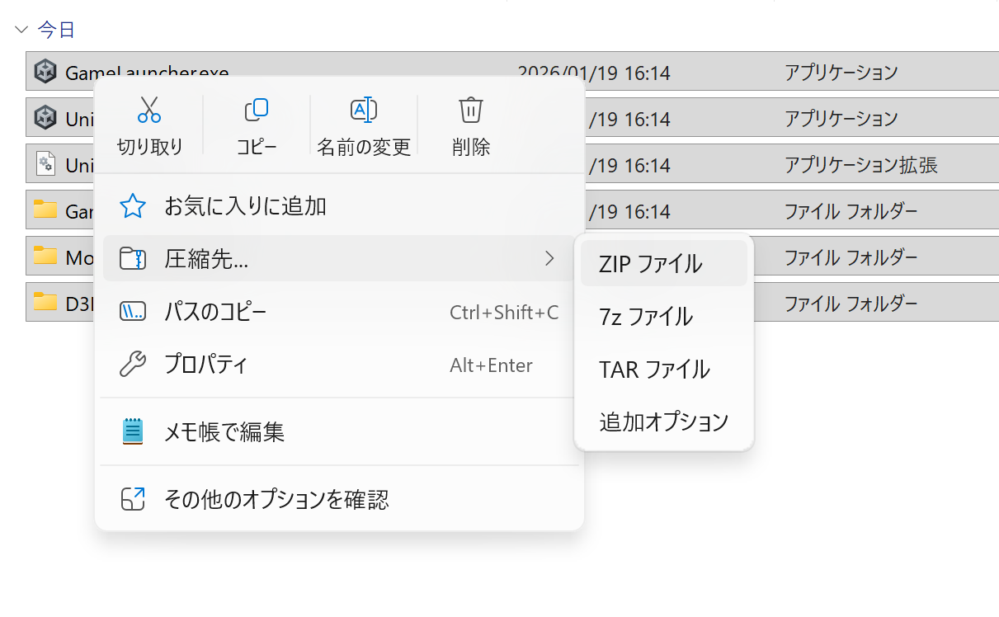

- 生成されたzipファイルの名前は先ほど命名した「GameLauncher_vX.Y.Z」と同じ名前にする

- 下記URLにゲームランチャー.zipをアップロード
  - https://github.com/Ukun115/StudentProductions/releases/tag/GameLauncher
  - 【注意】過去バージョンのゲームランチャー.zipを削除しない

- アップロード終わったら「Update release」押下

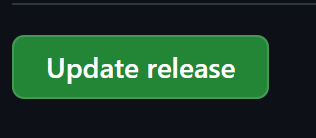

- これで配布用ゲームランチャーが配布できている状態になりました。

## 【GitGUI+Reame記載編】
- Forkにてゲームランチャーリポジトリの差分をステージング→コミット→プッシュ→GitHubにてプルリク→マージまでを行う。
  - 【注意】mainに間違ってあげない
  - セルフマージOK
  - プルリクのタイトルは「ナンバリング+ゲーム追加(vX.Y.Z)」のように記載
  - ex)003ゲーム追加(v1.2.0)

- 下記リンクにあるReadmeを編集
  - https://github.com/Ukun115/StudentProductions

  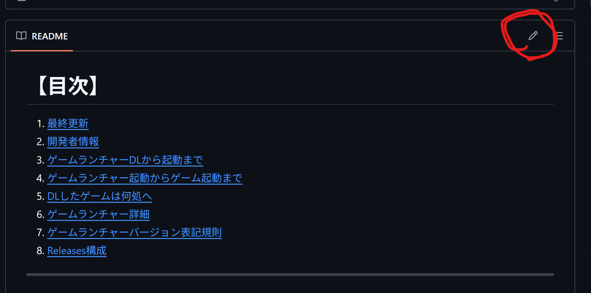

  - 記載場所は、「最終更新」のみでOK。
  - 「Commit message」は「Readme更新」と記載しておいて下さい。

  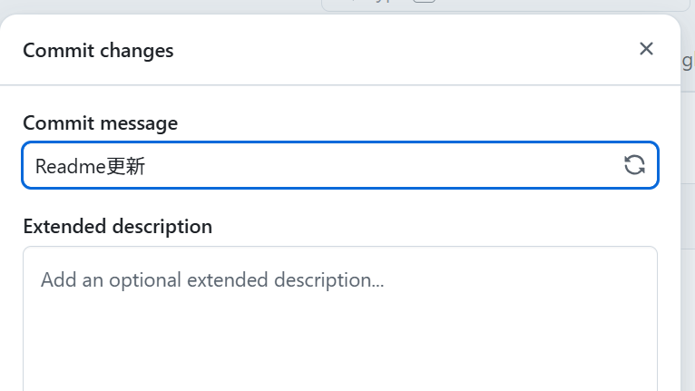

## 【Finish】
お疲れ様でした！ドキュメント分かりにくい場所あれば伊関までお知らせください。
