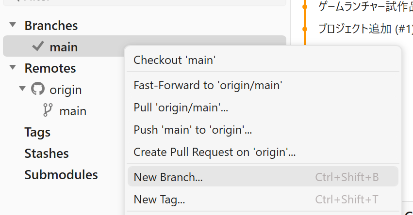
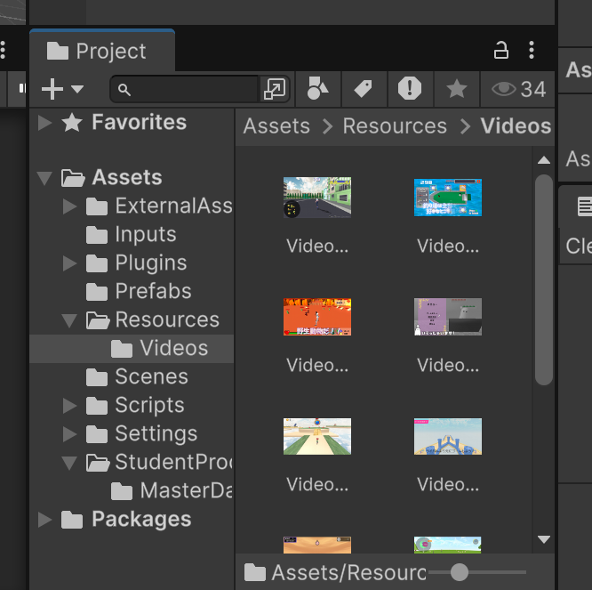
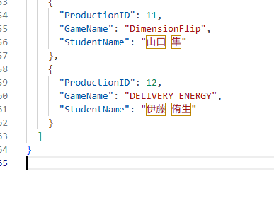
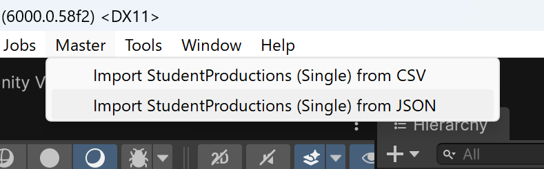
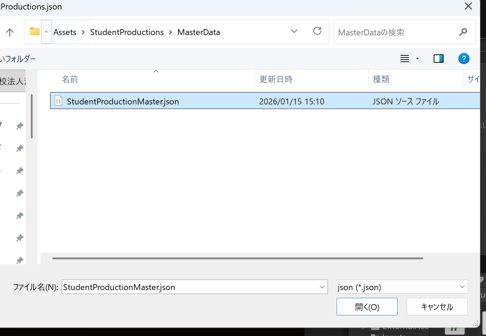

# 【ゲーム追加フロー】
## 【準備物編】
- ROM
  - Releaseでビルドしたやつ
  - エラー落ちしないかどうか必ず確認
- ゲーム動画
  - PVが望ましい
  - 100MB以下の制限あり。60sくらいの動画だったら大丈夫なはず。
 
## 【GitGUI編】
- 下記リンクからリポジトリを落としてくる。
  - https://github.com/Ukun115/GameLauncher
  - privateアクセスなので、伊関からコラボレーターとしてリポジトリに参加しないと「404 not found」が出てきます。
  - 【注意】zipをDLしてこないよう注意。リポジトリをクローンしてください。
- GitGUIはおそらく「Fork」を使用するはず
- 最新mainから作業ブランチ作成
  - ブランチ名は「苗字/作業内容」
  - ex) iseki/addGames

- Assets/Resources/Videosの中にゲーム動画を格納
  - 動画ファイル名をゲームのナンバリングに沿って命名変更
  - ex) Video013.mp4

- Assets/StudentProductions/MasterData/StudentProductionMaster.jsonの最後尾にマスターデータを追加
  - 書き方は既存のマスターデータをマネてください。
  - マスターデータの各項目は基本持たせてください。無い場合はnullでOK。

- Assets/StudentProductions/MasterData/StudentProductionsMaster.assetを削除
  - 古いScriptableObjectなので、Jsonに追加したマスターデータを含むScriptableObjectを作らないといけない

- 下の画像からAssets/StudentProductions/MasterData/StudentProductionMaster.jsonを選択しJsonデータをインポート。新しいScriptableObjectを作成。

- Launch.sceneのMainCanvas/VersionTextオブジェクトのTextMeshPro-Textのテキストを次のバージョン表記に変更し、シーンを保存。

- 以上でUnity側の設定は終わり。

- 次にGitHub側の設定を行う。

- 下記リポジトリへアクセス
  - https://github.com/Ukun115/StudentProductions

- Releasesをクリック

- 「Draft a new release」をクリック

- タグ作成。「Create new tag」から新しいタグを作成。
  - ゲームごとに3桁でナンバリングしています。最新のナンバリングに+1した値にしてください。

- 